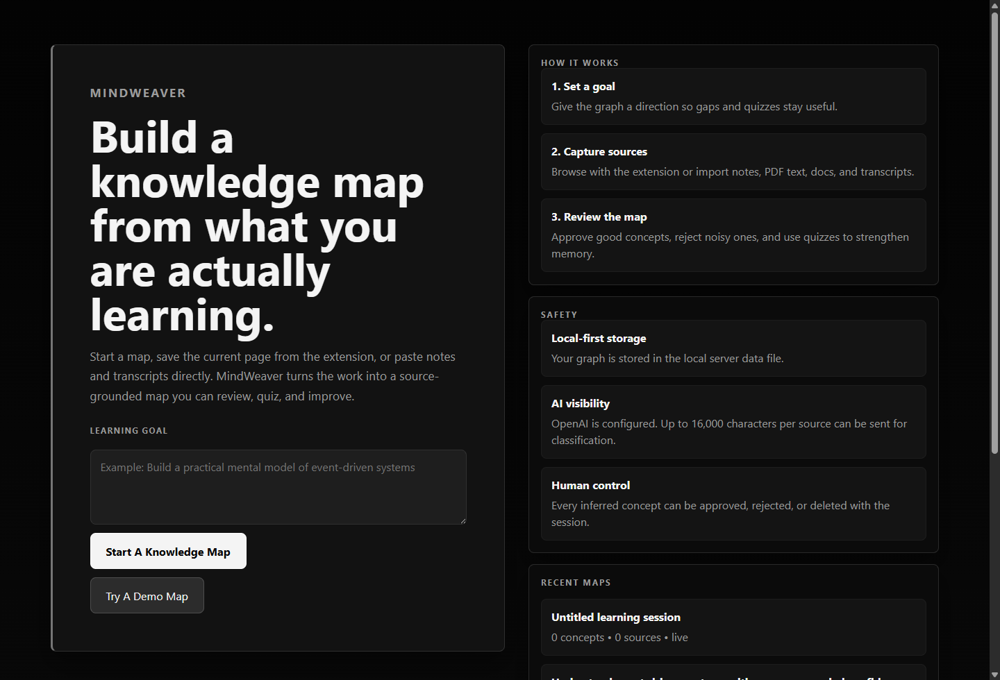
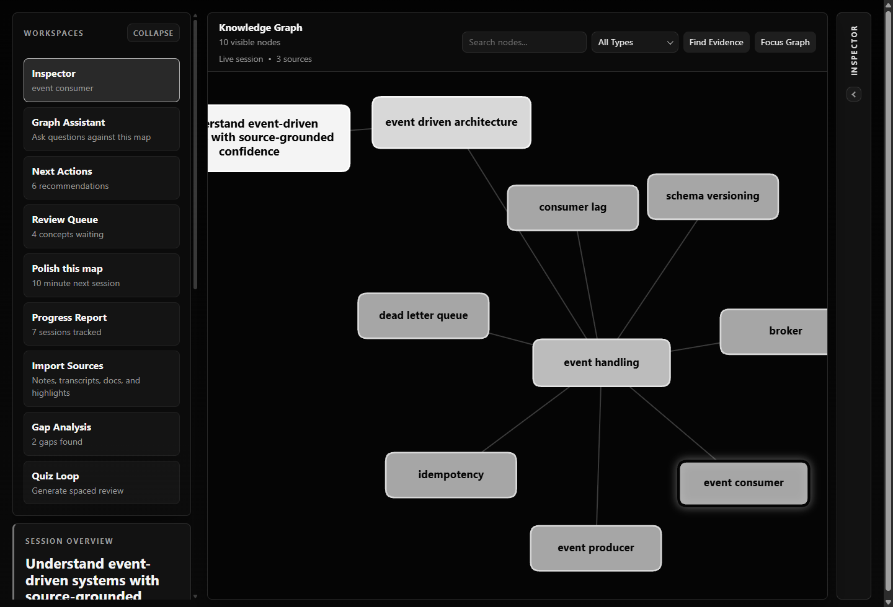
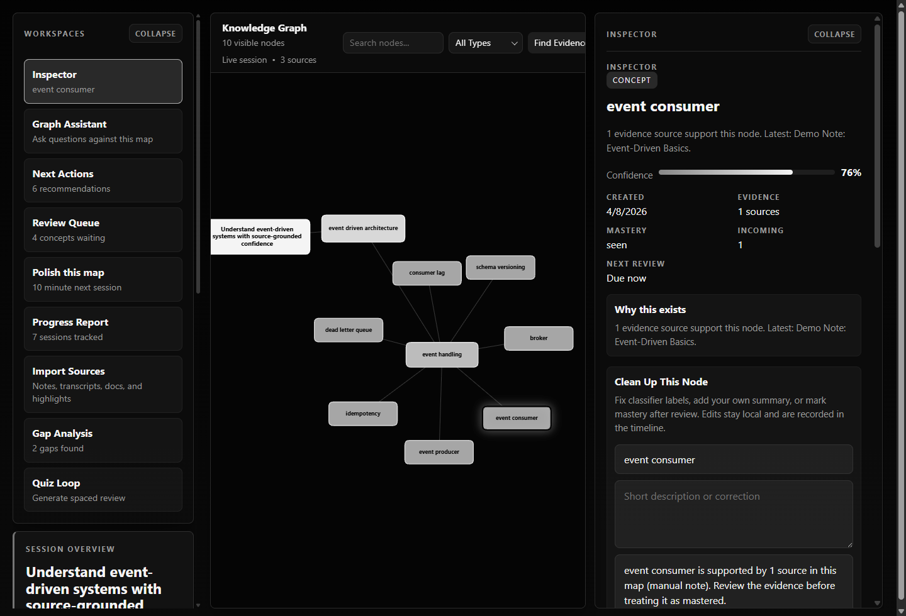
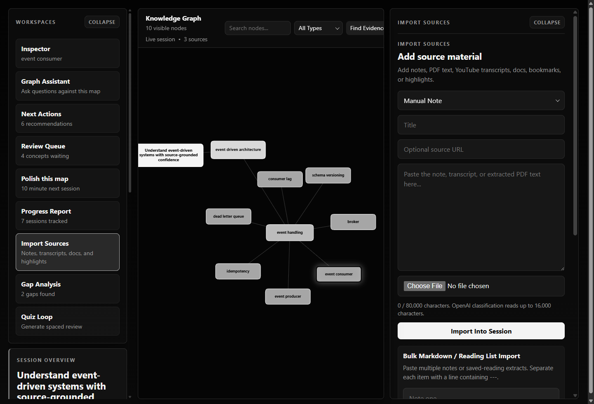

# MindWeaver

Source-grounded knowledge maps for personal learning.

MindWeaver helps you turn pages, notes, transcripts, docs, and highlights into a graph you can inspect, clean up, quiz against, and export. It is designed for people who want a map of what they are actually learning, not just another pile of saved links.

> Open-source alpha. Local-first. Single-user. Best experienced on your own machine.

<p align="center">
  
</p>

## What It Does

- Capture source material from the Chrome extension or paste it directly into the app.
- Organize learning into goals, domains, skills, concepts, and relationships.
- Keep provenance visible so every concept can be traced back to source material.
- Review noisy AI output instead of trusting it blindly.
- Run gap analysis, study plans, quiz loops, and source-grounded graph chat.
- Export maps as Markdown, JSON, or full local backups.

## What It Looks Like

| Graph workspace | Inspector and cleanup |
| --- | --- |
|  |  |

| Import workflow |
| --- |
|  |

## Quick Start

### 1. Install dependencies

```bash
npm run setup
```

### 2. Create a local env file

```bash
copy server\.env.example server\.env.local
```

Then edit `server/.env.local`.

If you want AI-powered classification, chat, quizzes, and richer gap analysis, set:

```bash
OPENAI_API_KEY=your_key_here
```

MindWeaver still runs without an OpenAI key, but some features fall back to simpler local behavior.

### 3. Start the app

```bash
npm run dev
```

That starts:

- web app: `http://127.0.0.1:5197`
- API server: `http://127.0.0.1:3001`

### 4. Fastest possible first run

1. Open `http://127.0.0.1:5197`
2. Click `Try A Demo Map`
3. Click nodes in the graph
4. Open `Inspector`
5. Open `Import Sources`
6. Run `Gap Analysis` or `Generate Quiz`

If you just want to kick the tires, the demo map is the best starting point.

## Production-Style Local Run

If you want a single-server local run that serves the built app through Express:

```bash
npm run build
npm run start
```

Then open:

- app: `http://127.0.0.1:3001`
- health: `http://127.0.0.1:3001/api/health`

On Windows, you can also double-click:

- [`start-app.bat`](start-app.bat)
- [`start-production.bat`](start-production.bat)

## A 5-Minute Tour

### 1. Start with a goal

Create a fresh map for something concrete:

- "Build a practical mental model of event-driven systems"
- "Understand RL enough to implement PPO"
- "Learn the moving parts of Stripe subscriptions"

A goal gives the graph a direction and makes gap analysis useful.

### 2. Add source material

You can use MindWeaver in two ways:

- with the Chrome extension for saving live pages and selected highlights
- without the extension by importing notes, transcripts, PDF text, bookmarks, docs, and Markdown directly in the app

The import panel supports:

- manual notes
- PDF text
- YouTube transcripts
- documents
- Markdown notes
- bookmarks
- repository/docs excerpts
- highlights

### 3. Review the graph

The graph is the main character of the product.

Use it to:

- search nodes
- filter by type
- inspect one concept at a time
- merge duplicates
- approve or reject weak nodes
- add or review relationships

### 4. Clean up concepts

The `Inspector` lets you:

- rename nodes
- write your own explanation
- change mastery state
- merge duplicates
- review edge quality
- remove bad evidence

This is where MindWeaver becomes your tool instead of an opaque classifier.

### 5. Strengthen the map

The right-side workspaces are built around actual study actions:

- `Graph Assistant` for source-grounded questions
- `Next Actions` for concrete follow-up work
- `Review Queue` for noisy or weak concepts
- `Import Sources` for adding material
- `Gap Analysis` for missing areas
- `Quiz Loop` for spaced-review questions
- `Progress Report` for session history

### 6. Export what matters

When the map is useful, you can:

- export Markdown
- export JSON
- download a full backup
- restore from backup later

## Use It Without The Extension

You do not need the browser extension to get value from MindWeaver.

Good local-only workflows:

- paste lecture notes after a study session
- import a transcript from a video you watched
- paste text from a PDF you already own
- dump saved reading notes as Markdown
- add repo docs or architecture notes before a project deep dive

If you are sharing the repo publicly, this is the easiest path to recommend.

## Use It With The Chrome Extension

Load the extension from [`extension/`](extension/README.md):

1. Open `chrome://extensions`
2. Enable Developer Mode
3. Click `Load unpacked`
4. Select the [`extension`](extension) folder
5. Make sure the MindWeaver server is running locally
6. Click the extension icon
7. Save the current page or save selected text

The extension is explicit and on-demand:

- it does not continuously track browsing
- it injects extraction only after you click save
- it sends data only to your local MindWeaver server

## What Works Today

- local session creation
- demo maps for quick exploration
- graph browsing and node inspection
- manual imports and bulk Markdown import
- source-backed node editing and review
- duplicate merging and edge review
- local backup and restore
- Markdown and JSON export
- graph chat
- gap analysis
- quiz generation
- progress reporting

## What Is Still Rough

- this is not a hosted multi-user product
- persistence is still local JSON storage
- the browser extension is a power-user workflow, not a polished store release
- some AI-heavy flows are meaningfully better with a configured OpenAI key
- the project is still evolving quickly and the UI may keep changing

## Privacy And AI Boundary

MindWeaver is local-first.

- local runtime data lives in `server/data.json`
- `.env.local` files and local data are git-ignored
- OpenAI requests are made from the local server, not the extension UI
- bounded slices of imported content are sent for AI-backed features when OpenAI is configured

Do not import data you are not comfortable sending to the configured OpenAI account.

More detail: [Security And Privacy](docs/SECURITY.md)

## Scripts

```bash
npm run setup        # install server and web dependencies
npm run dev          # run server + web together
npm run dev:server   # backend only
npm run dev:web      # frontend only
npm run build        # build the web app
npm run start        # start the production-style Express server
npm run test         # run backend tests
npm run check        # tests + build
npm run eval:fixtures
```

## Repo Map

- [`web/`](web): Vite + React graph UI
- [`server/`](server): Express API, persistence, and AI-backed learning endpoints
- [`extension/`](extension/README.md): Chrome extension for saving pages and highlights
- [`docs/`](docs/README.md): architecture, API, development, product, and security docs
- [`scripts/`](scripts): local development helpers
- [`TODO.md`](TODO.md): roadmap and deferred product work

## Documentation

- [Development Guide](docs/DEVELOPMENT.md)
- [Architecture](docs/ARCHITECTURE.md)
- [API Reference](docs/API.md)
- [Security And Privacy](docs/SECURITY.md)
- [Product Notes](docs/PRODUCT.md)
- [Extension README](extension/README.md)

## Open-Source Boundary

MindWeaver is ready to share as an open-source local-first alpha.

It is not yet a hosted multi-tenant SaaS. If you want to put it on the public internet later, the next major work is auth, authorization, hosted persistence, and hardening around destructive endpoints and private user data.
