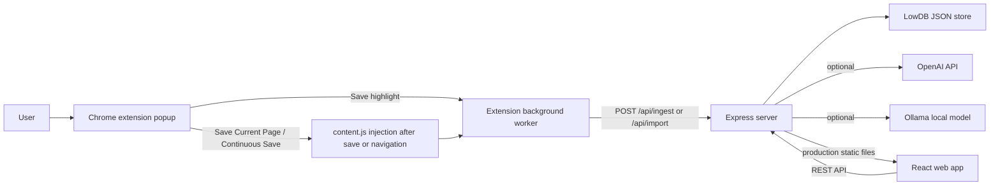

# Architecture

MindWeaver is a local-first app with a Chrome extension, an Express API, a Vite/React web UI, an optional Windows desktop shell, and a local MCP server for agent access.



## Components

### Extension

The extension is an explicit save surface, not a continuous browsing tracker.

- `popup.js` creates sessions, opens the app, and sends `CAPTURE_ACTIVE_TAB` messages.
- `background.js` injects `content.js` only after the save button is clicked.
- `content.js` extracts readable page text and returns the payload to the background worker.
- The context menu saves selected text as a `highlight` import.

### Server

The server owns persistence, graph mutations, AI calls, and production static serving.

- `server/index.js` loads `.env.local`, initializes the database, builds the AI clients, and starts Express.
- `server/app.js` defines the API routes and delegates most graph and learning behavior to extracted services.
- `server/db.js` defines the default LowDB data shape and initializes the local JSON file.
- `server/openai.js` wraps OpenAI and Ollama calls with timeouts, structured-output validation, and provider-specific request shaping.
- `server/services/shared-service.js` holds shared constants and low-level graph/session helpers.
- `server/services/graph-service.js` owns node serialization, exports, notes, graph summaries, and session graph composition.
- `server/services/import-service.js` owns ingest/import parsing, artifact handling, and chat-history import logic.
- `server/services/refine-service.js` owns graph cleanup, dedupe, and refine flows.
- `server/services/learning-service.js` owns gap analysis, quiz, summary, chat, and explanation helpers.

### Web

The web app is a Vite + React UI for map exploration and cleanup.

- `web/src/App.jsx` now acts as the top-level workspace orchestrator for data loading, graph interactions, manual refresh, and panel state.
- `web/src/components/` holds extracted UI building blocks such as map panels and shared controls.
- `web/src/components/graph/` holds graph-only UI such as the minimap.
- `web/src/components/notes/` holds Markdown note rendering helpers used by the inspector.
- `web/src/hooks/` holds reusable browser-state hooks such as local-storage persistence and session-route syncing.
- `web/src/lib/` holds frontend constants, formatting helpers, graph rendering helpers, graph traversal/layout helpers, and chat-import preview parsing.
- `web/src/app.css` contains the shared app styling.
- `web/src/ErrorBoundary.jsx` prevents React render failures from blanking the whole app.

The frontend is being split toward a clearer pattern:

- `App.jsx` coordinates stateful workflows and cross-panel mutations.
- `components/` owns presentational slices.
- `hooks/` owns browser-specific React behavior.
- `lib/` owns pure helpers that are safe to unit test.

In development, the web app runs on `http://localhost:5197` and talks to `http://localhost:3001`. In production-style local mode, Express serves `web/dist` from `http://127.0.0.1:3001`.

### Desktop

The Windows desktop app wraps the same local MindWeaver workspace in Electron. It can stay available from the tray after the main window is closed, open quick notes, import clipboard or document text, launch extension setup, and open the Agent Access workspace.

Packaged desktop installs use the shared default graph file:

```text
%APPDATA%\MindWeaver\mindweaver-data.json
```

### MCP Server

`server/mcp.js` exposes additive graph tools over stdio so Codex, Claude Code, and other MCP clients can read maps, search concepts, traverse relationships, and add bounded notes or graph structure. The MCP server intentionally avoids destructive graph tools such as delete, prune, and restore.

## Data Model

LowDB stores local data in a JSON file. Local source checkouts use `server/data.json` unless `MINDWEAVER_DATA_FILE` points somewhere else. The packaged desktop app, generated MCP launcher, and default desktop/web flow use `%APPDATA%\MindWeaver\mindweaver-data.json`.

Core collections:

- `sessions`: learning maps and session metadata.
- `goals`: explicit learning goals for sessions.
- `nodes`: graph nodes such as `goal`, `domain`, `skill`, and `concept`.
- `nodes.sessionNotes`: per-session Markdown notes attached to nodes and surfaced in the inspector/export flows.
- `edges`: graph relationships such as `contains`, `builds_on`, `related`, `prerequisite`, `supports`, `contrasts`, and `needs`.
- `artifacts`: saved pages, notes, transcripts, highlights, and imported text sources.
- `verifications`: quiz/review outcomes.
- `reports`: generated summaries.
- `users` and `workspaces`: local-first foundations for future hosted/team support.
- `preferences`: shared active-map state, open map tabs, and selected AI settings.

## Ingestion Flow

1. A user clicks `Save Current Page` in the extension or turns on `Continuous Save`.
2. The extension creates a session if needed.
3. The background worker injects `content.js` into the active tab after `Save Current Page`, while `Continuous Save` observes newly visited pages, or when a single-page app changes routes.
4. The extracted page payload is sent to `POST /api/ingest`.
5. The server runs page saves through a FIFO queue and dedupes by `sessionId + url`.
6. The server checks whether the page is worth ingesting, then classifies the source with the selected AI provider and provider-specific content limits.
7. Structured JSON responses are validated before they are allowed to mutate the graph.
8. The extension-side capture queue sends saved page payloads one after another, then the server updates nodes, edges, artifact provenance, review state, and recommendations before exact duplicate labels are merged conservatively.
9. The web app fetches `GET /api/graph/:sessionId` and renders the updated map when the canvas loads, the session changes, or the shared graph file changes.

## Learning Loop

MindWeaver is useful because capture, graph cleanup, and review all feed one another.

- Evidence creates or strengthens concepts.
- Manual review changes confidence and verification state.
- Gap analysis creates missing-concept nodes and next actions.
- Quizzes update confidence and review scheduling.
- Cleanup actions, such as merge and prune, make the map more trustworthy.
- Session-scoped Markdown notes let users preserve interpretation without pretending that personal notes are source evidence.
- Exports and backups preserve the local learning record.

## Production Boundary

The current app is productionized for a local-first single-user workflow. Hosted/team use needs additional work before public deployment:

- authentication,
- authorization,
- encrypted multi-user persistence,
- hosted secrets management,
- server-side permission checks,
- operational monitoring and backups.
