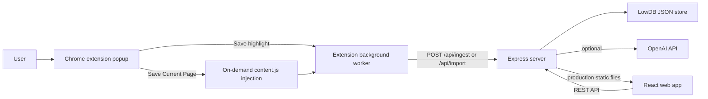

# Architecture

MindWeaver is a local-first app with three runtime pieces: a Chrome extension, an Express API, and a Vite/React web UI.

## Components

### Extension

The extension is an explicit save surface, not a continuous browsing tracker.

- `popup.js` creates sessions, opens the app, and sends `CAPTURE_ACTIVE_TAB` messages.
- `background.js` injects `content.js` only after the save button is clicked.
- `content.js` extracts readable page text and returns the payload to the background worker.
- The context menu saves selected text as a `highlight` import.

### Server

The server owns persistence, graph mutations, AI calls, and production static serving.

- `server/index.js` loads `.env.local`, initializes the database, builds the OpenAI client, and starts Express.
- `server/app.js` defines all API routes and most product logic.
- `server/db.js` defines the default LowDB data shape and initializes the local JSON file.
- `server/openai.js` wraps OpenAI calls with timeouts and safer JSON parsing.

### Web

The web app is a Vite + React UI for map exploration and cleanup.

- `web/src/App.jsx` now acts as the top-level workspace orchestrator for data loading, graph interactions, and panel state.
- `web/src/components/` holds extracted UI building blocks such as map panels and shared controls.
- `web/src/hooks/` holds reusable browser-state hooks such as local-storage persistence and session-route syncing.
- `web/src/lib/` holds frontend constants, formatting helpers, graph rendering helpers, and chat-import preview parsing.
- `web/src/app.css` contains the shared app styling.
- `web/src/ErrorBoundary.jsx` prevents React render failures from blanking the whole app.

The frontend is being split toward a clearer pattern:

- `App.jsx` coordinates stateful workflows and cross-panel mutations.
- `components/` owns presentational slices.
- `hooks/` owns browser-specific React behavior.
- `lib/` owns pure helpers that are safe to unit test.

In development, the web app runs on `http://localhost:5197` and talks to `http://localhost:3001`. In production-style local mode, Express serves `web/dist` from `http://127.0.0.1:3001`.

## Data Model

LowDB stores local data in `server/data.json`, which is intentionally ignored by Git.

Core collections:

- `sessions`: learning maps and session metadata.
- `goals`: explicit learning goals for sessions.
- `nodes`: graph nodes such as `goal`, `domain`, `skill`, and `concept`.
- `edges`: graph relationships such as `contains`, `builds_on`, `related`, `prerequisite`, `supports`, `contrasts`, and `needs`.
- `artifacts`: saved pages, notes, transcripts, highlights, and imported text sources.
- `verifications`: quiz/review outcomes.
- `reports`: generated summaries.
- `users` and `workspaces`: local-first foundations for future hosted/team support.

## Ingestion Flow

1. A user clicks `Save Current Page` in the extension.
2. The extension creates a session if needed.
3. The background worker injects `content.js` into the active tab.
4. The extracted page payload is sent to `POST /api/ingest`.
5. The server dedupes by `sessionId + url`.
6. The server checks whether the page is worth ingesting.
7. The server classifies the source into domain, skill, and concepts.
8. Nodes, edges, artifact provenance, review state, and recommendations are updated.
9. The web app fetches `GET /api/graph/:sessionId` and renders the updated map.

## Learning Loop

MindWeaver is useful because capture, graph cleanup, and review all feed one another.

- Evidence creates or strengthens concepts.
- Manual review changes confidence and verification state.
- Gap analysis creates missing-concept nodes and next actions.
- Quizzes update confidence and review scheduling.
- Cleanup actions, such as merge and prune, make the map more trustworthy.
- Exports and backups preserve the local learning record.

## Production Boundary

The current app is productionized for a local-first single-user workflow. Hosted/team use needs additional work before public deployment:

- authentication,
- authorization,
- encrypted multi-user persistence,
- hosted secrets management,
- server-side permission checks,
- operational monitoring and backups.
